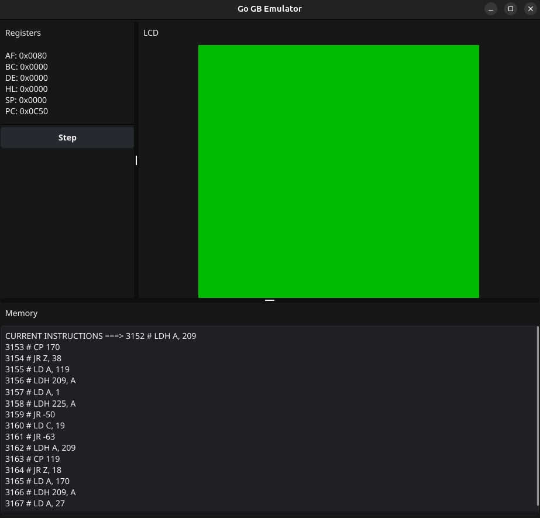

# Gameboy Emulator 

Attempt to write a Game Boy Emulator in Golang.



Work in progress, not usable yet !

How to launch:

Copy a gameboy rom as "testrom.gb" in the root directory of your clone.
It must be a 32KB rom at most without any fancy custom banks, this doesn't support mappers & bank switching yet !

```go run main.go```

What's done so far:

* Partial instructions set implemented for Z80 CPU
* Disassembler (probably still inaccurate)
* Basic GUI to step on program

